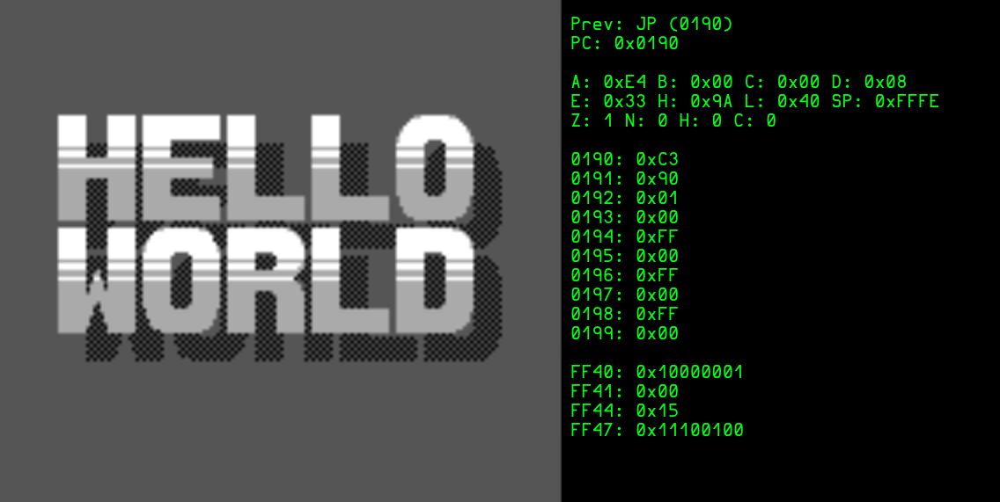

# DMGO - A Gameboy emulator written in Go

Another Gameboy emulator written in Go, using [Ebitengine](https://ebitengine.org/) for rendering and display

## Status

- Basic rendering of the VRAM contents via the PPU, with tilemaps and OAM sprites.
- Primitive and very incorrect CPU and PPU timing clocks
- A rubbish builtin debugger
- About 13% of the opcodes
- Almost nothing else

## Reference Collection

Docs, so many docs

- https://gbdev.io/
- https://gbdev.io/pandocs/
- https://gbdev.io/gb-opcodes/optables/dark
- https://github.com/Gekkio/gb-ctr
- https://gbdev.io/pandocs/CPU_Instruction_Set.html

Inspiration projects

- https://github.com/jacoblister/emuboy
- https://github.com/Humpheh/goboy

Cool videos

- https://www.youtube.com/watch?v=HyzD8pNlpwI
