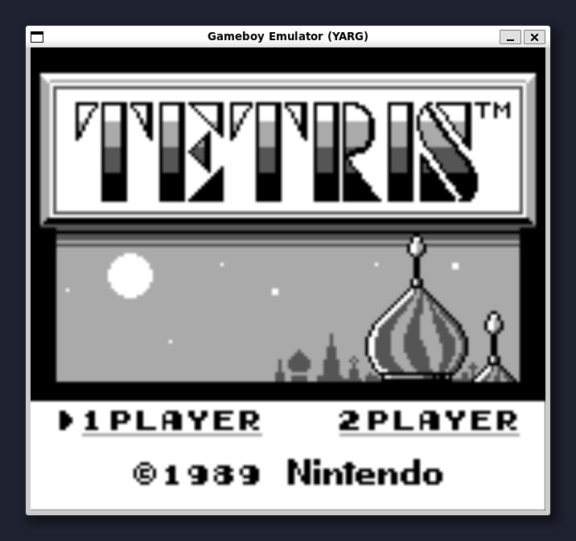

# A Gameboy emulator written in Go

A Gameboy emulator written in Go, using Ebitengine for rendering and display

## Status

- Rendering of the VRAM via the PPU, with tilemaps and OAM sprites
- About 2% of the opcodes
- Almost nothing else

## Docs

https://gbdev.io/pandocs/

https://github.com/jacoblister/emuboy
https://crocidb.com/post/gameboy-emulator1/

## Game Boy CPU (SM83)

https://gbdev.io/pandocs/CPU_Instruction_Set.html
https://gbdev.io/gb-opcodes/optables/dark
