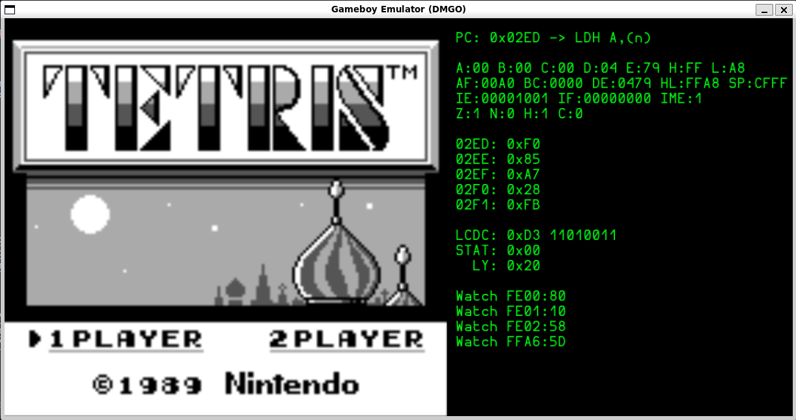

# DMGO - A Gameboy emulator written in Go

Another Gameboy emulator written in Go, using [Ebitengine](https://ebitengine.org/) for rendering and display



## Status

- Boots some ROMs, and runs the Gameboy boot ROM if present
- About 60% of the CPU opcodes
- About 1% of the CB prefix opcodes
- PPU: Functional rendering but incomplete (e.g. scanlines)
- Timing: CPU and PPU mostly clock correct
- No input
- No sound

## Reference Collection

Docs, so many docs

- https://gbdev.io/
- https://gbdev.io/pandocs/
- https://gbdev.io/gb-opcodes/optables/dark
- https://github.com/Gekkio/gb-ctr
- https://gbdev.io/pandocs/CPU_Instruction_Set.html

Inspiration projects

- https://github.com/jacoblister/emuboy
- https://github.com/Humpheh/goboy
- https://github.com/ArcticXWolf/AXWGameboy

Cool videos

- https://www.youtube.com/watch?v=HyzD8pNlpwI

---

Init states

```c
m_ProgramCounter=0x100;
m_RegisterAF=0x01B0;
m_RegisterBC=0x0013;
m_RegisterDE=0x00D8;
m_RegisterHL=0x014D;
m_StackPointer=0xFFFE;
m_Rom[0xFF05] = 0x00 ;
m_Rom[0xFF06] = 0x00 ;
m_Rom[0xFF07] = 0x00 ;
m_Rom[0xFF10] = 0x80 ;
m_Rom[0xFF11] = 0xBF ;
m_Rom[0xFF12] = 0xF3 ;
m_Rom[0xFF14] = 0xBF ;
m_Rom[0xFF16] = 0x3F ;
m_Rom[0xFF17] = 0x00 ;
m_Rom[0xFF19] = 0xBF ;
m_Rom[0xFF1A] = 0x7F ;
m_Rom[0xFF1B] = 0xFF ;
m_Rom[0xFF1C] = 0x9F ;
m_Rom[0xFF1E] = 0xBF ;
m_Rom[0xFF20] = 0xFF ;
m_Rom[0xFF21] = 0x00 ;
m_Rom[0xFF22] = 0x00 ;
m_Rom[0xFF23] = 0xBF ;
m_Rom[0xFF24] = 0x77 ;
m_Rom[0xFF25] = 0xF3 ;
m_Rom[0xFF26] = 0xF1 ;
m_Rom[0xFF40] = 0x91 ;
m_Rom[0xFF42] = 0x00 ;
m_Rom[0xFF43] = 0x00 ;
m_Rom[0xFF45] = 0x00 ;
m_Rom[0xFF47] = 0xFC ;
m_Rom[0xFF48] = 0xFF ;
m_Rom[0xFF49] = 0xFF ;
m_Rom[0xFF4A] = 0x00 ;
m_Rom[0xFF4B] = 0x00 ;
m_Rom[0xFFFF] = 0x00 ;
```
